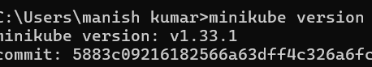
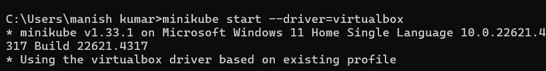
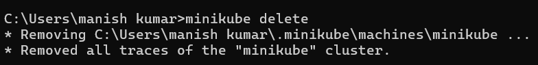
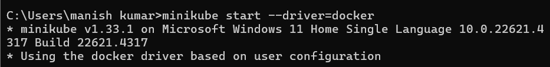
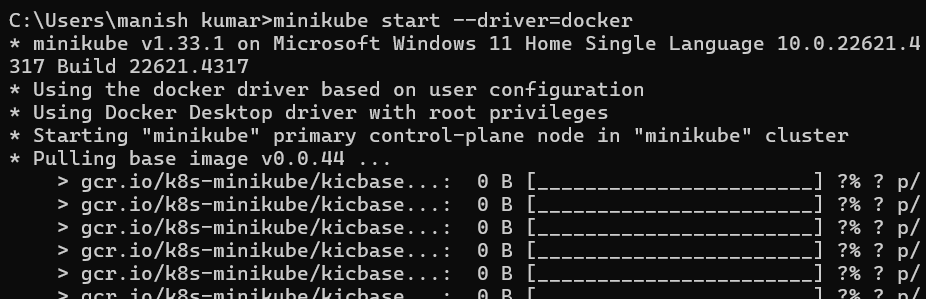
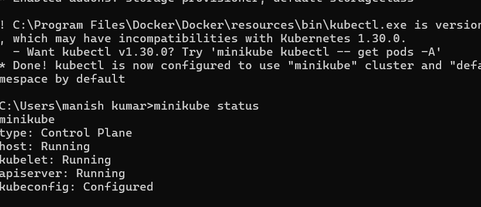
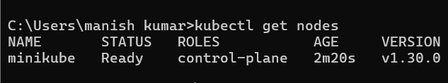
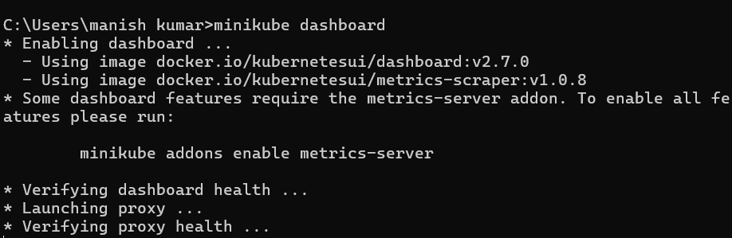
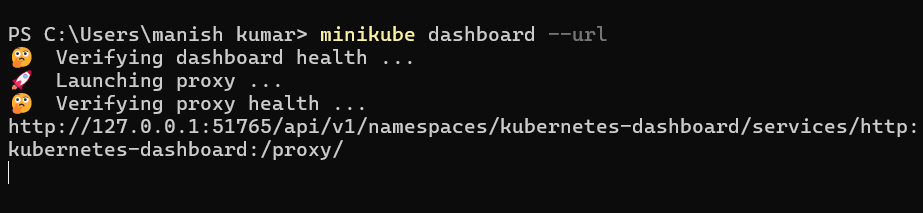
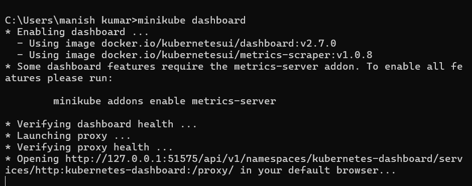

# Week 5 Task 1: Minikube Installation and Dashboard Setup

## Setting Up and Verifying Minikube with Docker Driver

This task involved installing Minikube and setting it up with Docker as the driver. We verified the setup using various Minikube and kubectl commands, and explored the Kubernetes dashboard. 

---

### Step 1: Check Minikube Version

```bash
minikube version
```


This verifies that Minikube is installed correctly and displays the installed version (v1.33.1). 

---

### Step 2: Attempt Start with VirtualBox Driver

```bash
minikube start --driver=virtualbox
```


This command attempts to start Minikube using the VirtualBox driver. It shows that Minikube is attempting to use VirtualBox based on the existing profile.

---

### Step 3: Delete the Existing Cluster

```bash
minikube delete
```


Deletes any existing Minikube cluster and configurations to start fresh.

---

### Step 4: Start Minikube with Docker Driver

```bash
minikube start --driver=docker
```



Starts a new Minikube cluster using Docker as the driver. The images confirm that Minikube begins pulling required container images and dependencies.

---

### Step 5: Check Cluster Status

```bash
minikube status
```


This checks the running status of various Minikube components like the control plane, kubelet, and API server.

---

### Step 6: Verify Node Availability

```bash
kubectl get nodes
```


Shows that Minikube is running as a node in the Kubernetes cluster and is in "Ready" state.

---

### Step 7: Launch Kubernetes Dashboard

```bash
minikube dashboard
```


Enables the dashboard add-on. The output suggests enabling metrics-server for better monitoring.

---

### Step 8: Get Dashboard URL

```bash
minikube dashboard --url
```


Displays the localhost URL where the Kubernetes dashboard is available.

---

### Step 9: Open Dashboard in Browser

```bash
minikube dashboard
```


This launches the dashboard and opens it in the default browser, confirming successful Minikube and dashboard setup.

---