# Detailed Kubernetes Cluster Setup with Kubeadm on EC2 (Ubuntu)

This document provides a step-by-step guide for manually setting up a Kubernetes cluster on two Ubuntu EC2 instances using kubeadm. Each step includes the command executed, its purpose, its outcome, and a reference to the relevant screenshot.

## 1. Prerequisites and Instance Naming

**Description:** I launched two Ubuntu EC2 instances. For clarity and ease of management, I renamed them to `km` (Kubernetes Master) and `kw` (Kubernetes Worker). Security groups were configured to allow SSH access and all traffic between the instances. 

**CMD:**
```bash
# On the Master Node (e.g., ip-172-31-90-76 initially)
sudo hostnamectl set-hostname km

# On the Worker Node (e.g., ip-172-31-78-191 initially)
sudo hostnamectl set-hostname kw
```

**Why this CMD:** Renaming the hostnames makes it easier to identify and manage the instances within the cluster and in the documentation, replacing the generic EC2 private IPs.

**What did this CMD do?:** The hostname of the respective EC2 instance was changed to `km` or `kw`. This change is reflected in the terminal prompt after re-logging in. 

**SS Attached:**  
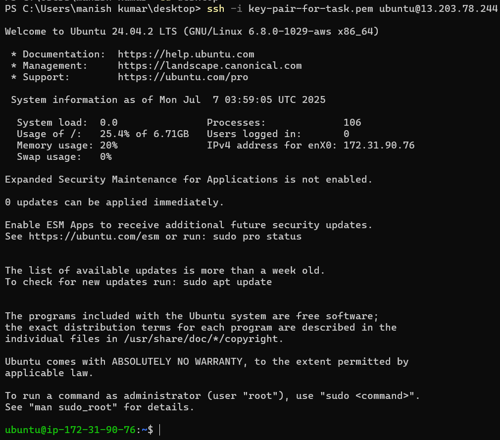  
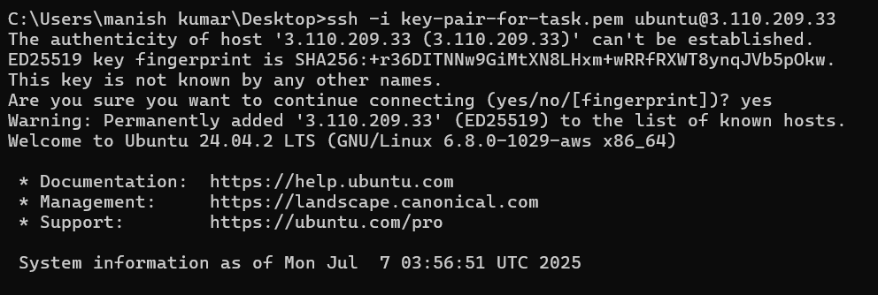

## 2. SSH into Both Instances

**Description:** Established secure shell connections to both EC2 instances using their respective key pairs.

**CMD:**
```bash
ssh -i key-pair-for-task.pem ubuntu@<Master_Public_IP>
ssh -i key-pair-for-task.pem ubuntu@<Worker_Public_IP>
```

**Why this CMD:** This is the initial access point to perform all subsequent configurations on the instances.

**What did this CMD do?:** Opened a command-line interface to each Ubuntu EC2 instance, allowing execution of commands.

**SS Attached:**  
  


## 3. Install Docker (on both km and kw)

**Description:** Docker is installed on both nodes to serve as the container runtime for Kubernetes.

**CMD:**
```bash
sudo apt update
sudo apt install -y docker.io
sudo systemctl enable docker
sudo systemctl start docker
```

**Why this CMD:** Kubernetes uses a container runtime (like Docker) to run the containers that make up your applications and the Kubernetes control plane itself.

**What did this CMD do?:**
- `apt update`: Updated the local package index.
- `install -y docker.io`: Installed Docker engine.
- `systemctl enable/start`: Enabled and started Docker.

**SS Attached:**  
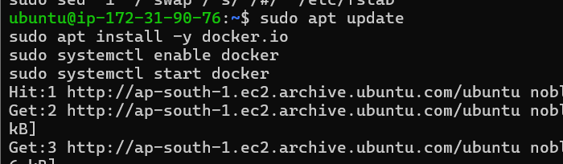  
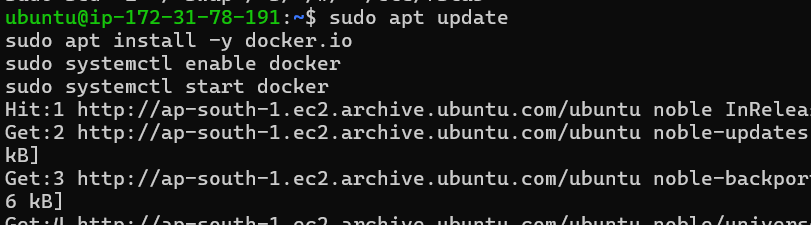

## 4. Install kubeadm, kubelet, kubectl (on both km and kw)

**Description:** These are the core Kubernetes tools required for setting up and managing the cluster.

**CMD:**
```bash
sudo apt install -y curl apt-transport-https ca-certificates gnupg
sudo curl -fsSLo /usr/share/keyrings/kubernetes-archive-keyring.gpg https://packages.cloud.google.com/apt/doc/apt-key.gpg
echo "deb [signed-by=/usr/share/keyrings/kubernetes-archive-keyring.gpg] https://apt.kubernetes.io/ kubernetes-xenial main" | sudo tee /etc/apt/sources.list.d/kubernetes.list
sudo apt update
sudo apt install -y kubelet kubeadm kubectl
sudo apt-mark hold kubelet kubeadm kubectl
```

**Why this CMD:** Prepares and installs Kubernetes binaries with proper security and stability.

**What did this CMD do?:** Installed and locked versions of kubelet, kubeadm, kubectl. 

**SS Attached:**  
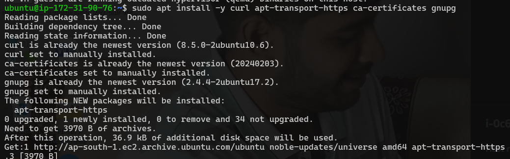  
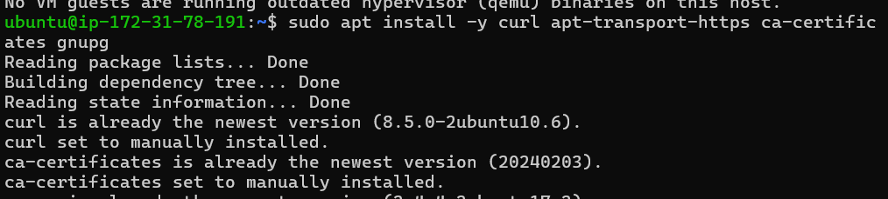  
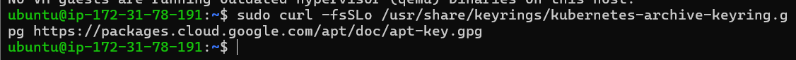  
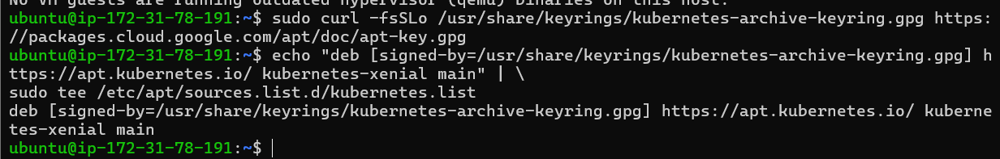  
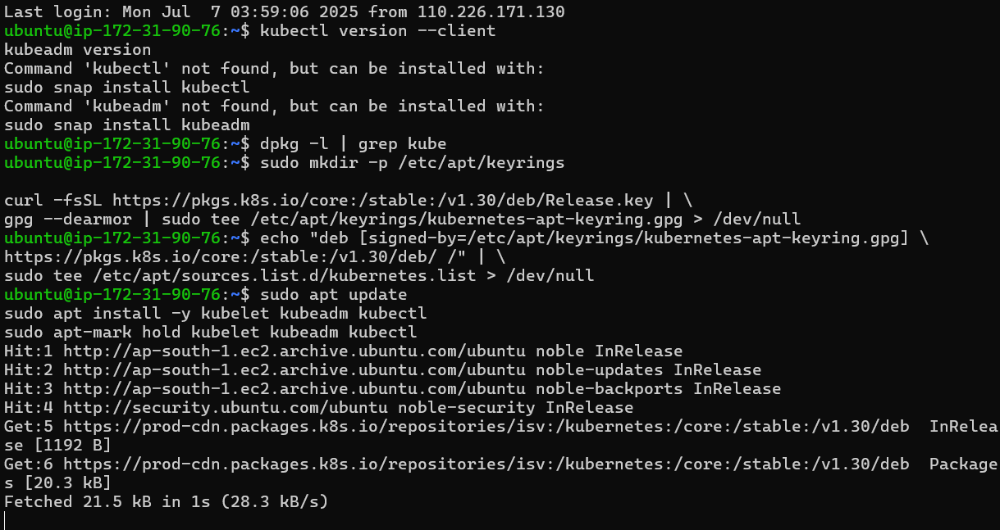  
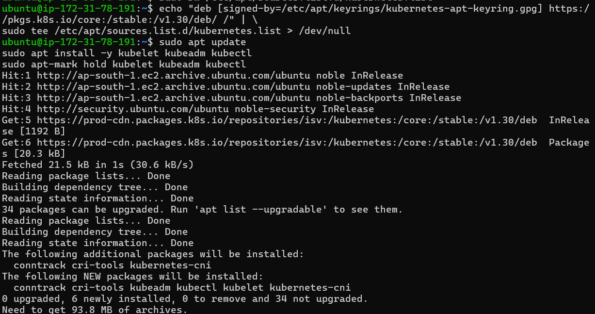  
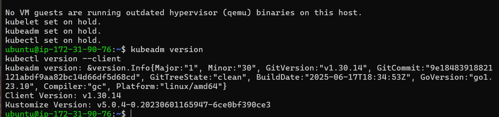  
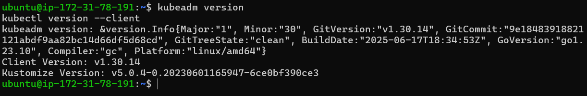  
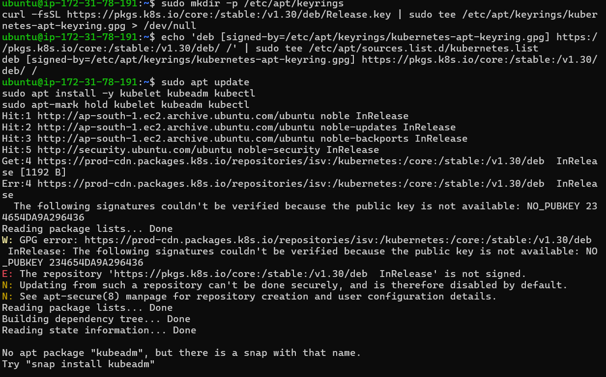  
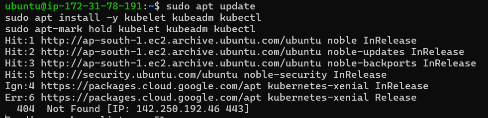

## 5. Disable Swap (on both km and kw)

**CMD:**
```bash
sudo swapoff -a
sudo sed -i '/ swap / s/^\(.*\)$/#/g' /etc/fstab
```

**Why this CMD:** Disabling swap is necessary as Kubernetes does not work well with it.

**SS Attached:**  
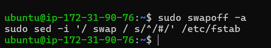  
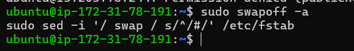

## 6. Initialize Master Node (km)

**CMD:**
```bash
sudo kubeadm init --pod-network-cidr=192.168.0.0/16 --apiserver-advertise-address=<YOUR_PRIVATE_IP_OF_MASTER>
```

**SS Attached:**  
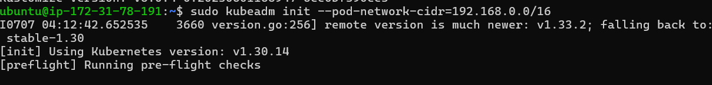  
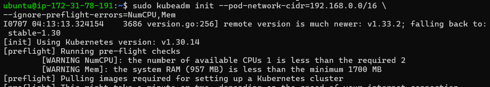  
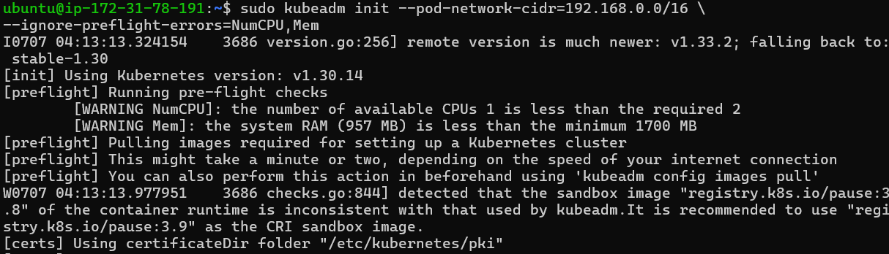

## 7. Configure kubectl on Master (km)

**CMD:**
```bash
mkdir -p $HOME/.kube
sudo cp -i /etc/kubernetes/admin.conf $HOME/.kube/config
sudo chown $(id -u):$(id -g) $HOME/.kube/config
```

**SS Attached:**  
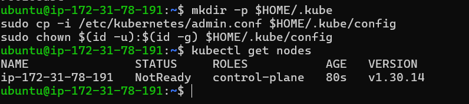

## 8. Install Pod Network (Calico) on Master (km)

**CMD:**
```bash
kubectl apply -f https://raw.githubusercontent.com/projectcalico/calico/v3.28.0/manifests/calico.yaml
```

**SS Attached:**  
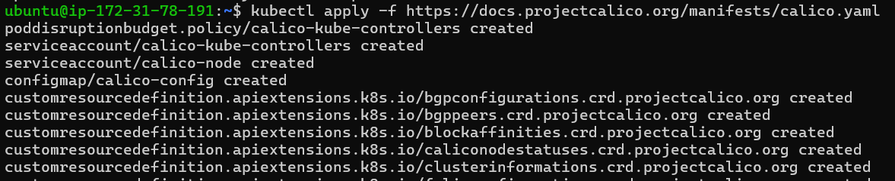

## 9. Join Worker Node (kw) to Cluster

**CMD:**
```bash
sudo kubeadm join <master-ip>:<master-port> --token <token> --discovery-token-ca-cert-hash sha256:<hash>
```

**SS Attached:**  
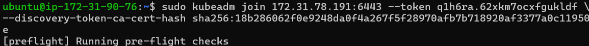

## 10. Verify Cluster (from Master Node km)

**CMD:**
```bash
kubectl get nodes
kubectl get pods -n kube-system
```

**SS Attached:**  
  
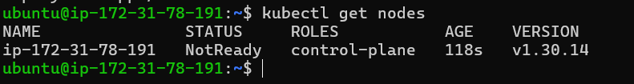  
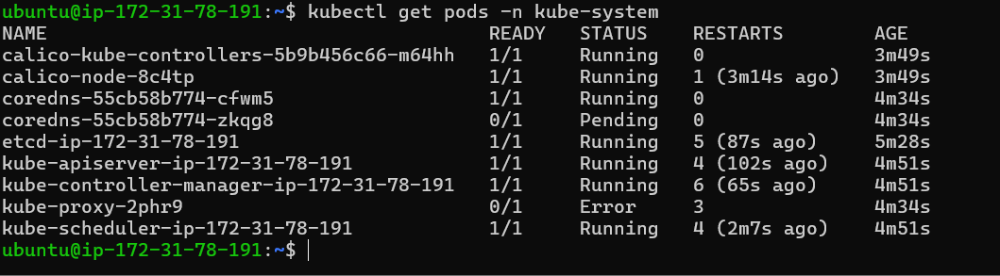

---

Your Kubernetes cluster is now set up and ready for deploying applications! 
