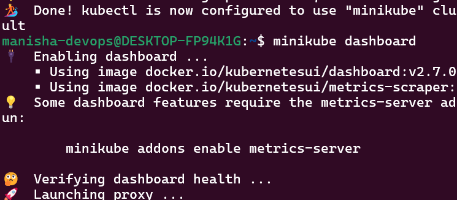

# Week 5 Task 2: Role-Based Access Control (RBAC) in Kubernetes

## Overview

In this task, we explored Role-Based Access Control (RBAC) in Kubernetes. We created a Role and RoleBinding to provide limited access permissions to a user within the default namespace, and verified the correct application through the dashboard and kubectl commands. We also created a ClusterRole and ClusterRoleBinding to provide access to the entire cluster, and demonstrated the difference between the two types of roles. 

---

### Step 1: Download and Install Minikube

```bash
curl -LO https://storage.googleapis.com/minikube/releases/latest/minikube-linux-amd64
sudo install minikube-linux-amd64 /usr/local/bin/minikube
```


Downloads and installs Minikube binary for Linux. The binary is downloaded from the official Minikube GitHub repository. The `curl` command is used to download the binary, and the `sudo install` command is used to install it in the `/usr/local/bin` directory. This step is necessary to run Minikube on the local machine. 

---

### Step 2: Start Minikube

```bash
sudo swapoff -a
minikube start --driver=docker
```


Starts a local Kubernetes cluster using Docker driver. The `sudo swapoff -a` command is used to disable swap memory, which is required for Minikube to function correctly. The `minikube start` command is used to start th ecluster, and the `--driver=docker` flag is used to specify the Docker driver. This step is necessary to create a local Kubernetes environment for testing and development purposes. 

---

### Step 3: Enable and Access Dashboard

```bash
minikube dashboard
```



Opens the Kubernetes dashboard for visual resource management. The `minikube dashboard` command is used to enable the dashboard, and the default web browser is launched to display the dashboard. This step is necessary to visualize the Kubernetes resources and manage them graph ically.

---

### Step 4: Create Role YAML

```bash
cat <<EOF > role.yaml
apiVersion: rbac.authorization.k8s.io/v1
kind: Role
metadata:
  namespace: default
  name: pod-reader
rules:
- apiGroups: [""]
  resources: ["pods"]
  verbs: ["get", "watch", "list"]
EOF
```


Creates a Role named `pod-reader` to allow read-only access to pods. The `cat < </ dev/stdin` command is used to create a new file named `role.yaml` and populate it with the Role definition. This step is necessary to define the Role and its permissions. 

---

### Step 5: Create RoleBinding YAML

```bash
cat <<EOF > rolebinding.yaml
apiVersion: rbac.authorization.k8s.io/v1
kind: RoleBinding
metadata:
  name: read-pods-binding
  namespace: default
subjects:
- kind: User
  name: demo-user
  apiGroup: rbac.authorization.k8s.io
roleRef:
  kind: Role
  name: pod-reader
  apiGroup: rbac.authorization.k8s.io
EOF
```


Binds the Role to a user named `demo-user` in the default namespace. 

---

### Step 6: Apply Role and RoleBinding

```bash
kubectl apply -f role.yaml
```


```bash
kubectl apply -f rolebinding.yaml
```


Applies the RBAC policies to the Kubernetes cluster. The `kubectl apply` command is used to create or update resources in the cluster. The `-f ` flag specifies the file to apply. 

---

### Step 7: Verify Role and RoleBinding

```bash
kubectl get roles
kubectl get rolebindings
```


Confirms the successful creation of the RBAC rules. The `kubectl get` command is used to retrieve information about resources in the cluster. The `roles ` and `rolebindings` commands are used to list the roles and rolebindings, respectively. 

---

### Step 8: List YAML Files

```bash
ls role*.yaml
```


Shows both `role.yaml` and `rolebinding.yaml` files are present. The `ls` command is used to list the files in the current directory. The `role*. yaml` pattern matches both `role.yaml` and `rolebinding.yaml` files.  