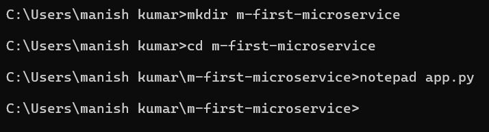
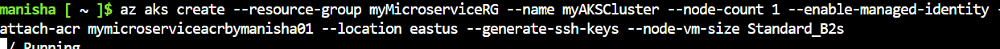

# Week 5 - Task 4

## Task: Deploy a Microservice Application on AKS Cluster and Access it via Public Internet

### Objective
To containerize a simple Python Flask microservice, push the Docker image to Azure Container Registry (ACR), deploy it on an Azure Kubernetes Service (AKS) cluster, and access the service using a public IP.

---

## Step-by-Step Actions

### Step 1: Setup Microservice Code and Requirements

**Command(s):**

```bash
mkdir m-first-microservice
cd m-first-microservice
notepad app.py
notepad requirements.txt
notepad Dockerfile
```

**Screenshot:**  


**Explanation:**  
Created the microservice project structure and files.

---

**Command:** *app.py content*  
**Screenshot:**  


**Explanation:**  
Basic Flask app with one endpoint returning a message.

---

**Command:** *requirements.txt content*  
**Screenshot:**  


**Explanation:**  
Declared Flask as the required dependency. 

---

**Command:** *Dockerfile content*  
**Screenshot:**  


**Explanation:**  
Dockerfile to containerize the microservice. It copies the app.py file into the container, sets the working directory to /app, exposes port 5000, and copies the requirements.txt file into the container. The RUN command installs the required Flask package.

---

### Step 2: Build Docker Image

**Command:**

```bash
dir
```

**Screenshot:**  


**Command:**

```bash
ren Dockerfile.txt Dockerfile
dir
```

**Screenshot:**  


**Explanation:**  
Ensured Dockerfile is correctly named for Docker to recognize. 

---

**Command:**

```bash
docker build -t hello-microservice:v1.0 .
```

**Screenshot:**  


**Explanation:**  
Error occurred due to misnamed Dockerfile (before fix). 

**Screenshot:**  
  
**Screenshot:**  


**Explanation:**  
Successfully built Docker image after fixing the issue. The build process took approximately 2 minutes and 30 seconds. The Docker image is now named "hello-microservice:v1.0". 

---

### Step 3: Login to Azure and Push Image to ACR

**Command:**

```bash
az login --use-device-code
```


**Command:**

```bash
az acr login --name mymicroserviceacrbymanisha01
```

**Screenshot:**  


---

**Command:**

```bash
docker tag hello-microservice:v1.0 mymicroserviceacrbymanisha01.azurecr.io/hello-microservice:v1.0
docker push mymicroserviceacrbymanisha01.azurecr.io/hello-microservice:v1.0
```

**Screenshot:**  
  


**Explanation:**  
Tagged and pushed Docker image to Azure Container Registry. 

---

**Command:**

```bash
az acr repository list --name mymicroserviceacrbymanisha01 --output table
```

**Screenshot:**  


---

### Step 4: Create and Configure AKS Cluster

**Command:**

```bash
az aks create ...
```

**Screenshot:**  
  


---

**Command:**

```bash
az aks get-credentials --resource-group myMicroserviceRG --name myAKSCluster
kubectl get nodes
nano deployment.yaml
kubectl apply -f deployment.yaml
```

**Screenshot:**  
  


**Explanation:**  
Connected to AKS cluster and deployed the microservice. 

---

**Command:** *deployment.yaml content*  
**Screenshot:**  


---

### Step 5: Access the Application via Public IP

**Command:**

```bash
kubectl get pods
kubectl get service flask-service
```

**Screenshot:**  


**Command:**

```bash
kubectl describe service flask-service
```

**Screenshot:**  


**Explanation:**  
Confirmed service exposed via LoadBalancer with public IP. Used `kubectl describe` to get more information about the service. 

**Browser Screenshot:**  


---

### Step 6: Manage Resources

**Command:**

```bash
kubectl delete pod -l app=flask-app
```

**Screenshot:**  


**Command:**

```bash
kubectl get pods
```

**Screenshot:**  


---

## Conclusion

Successfully built, containerized, and deployed a microservice Flask application on Azure Kubernetes Service and accessed it over the internet via LoadBalancer public IP. Managed resources using kubectl commands. 

