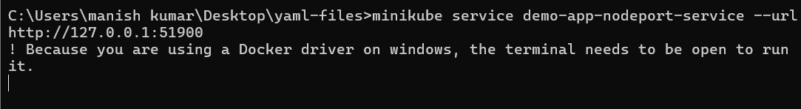

# Week 5 - Task 5

## Task: Expose services in the cluster with NodePort, ClusterIP, and LoadBalancer

In this task, we demonstrate how to expose a sample application (Nginx) deployed on a Minikube Kubernetes cluster using different service types: ClusterIP (internal), NodePort (external via node IP), and LoadBalancer (external with tunnel).

---

### Step 1: Clean Slate - Delete and Restart Minikube

**Command:**
```bash
minikube delete
minikube start
```

**Screenshot:** 

**Explanation:** This deletes any existing cluster and starts a fresh one to ensure there are no configuration conflicts from earlier setups.

---

### Step 2: Check Minikube Status

**Command:**
```bash
minikube status
```

**Screenshot:** 

**Explanation:** Verifies the components like kubelet, host, and apiserver are active and ready.

---

### Step 3: List Cluster Nodes

**Command:**
```bash
kubectl get nodes
```

**Screenshot:** 

**Explanation:** Confirms the `minikube` node is present and in a Ready state.

---

### Step 4: Verify System Pods

**Command:**
```bash
kubectl get pods -n kube-system
```

**Screenshot:** 

**Explanation:** Checks the core system pods to confirm the cluster is healthy.

---

### Step 5: Deploy Sample Application

**Command:**
```bash
kubectl create deployment demo-app --image=nginx
```

**Screenshot:** 

**Explanation:** Deploys the Nginx web server as a pod.

---

### Step 6: Check Deployment & Pods

**Command:**
```bash
kubectl get deployments
kubectl get pods
```

**Screenshot:** 

**Explanation:** Validates that the deployment and its pods are active.

---

### Step 7: Confirm Pod Running

**Command:**
```bash
kubectl get pods
```

**Screenshot:** 

**Explanation:** Re-confirms pod readiness before service exposure.

---

### Step 8: Expose via ClusterIP

**Command:**
```bash
kubectl apply -f clusterip-service.yaml
kubectl get svc
```

**Screenshot:** 

**Explanation:** ClusterIP exposes service internally only for communication inside the cluster.

---

### Step 9: Expose via NodePort

**Command:**
```bash
kubectl apply -f nodeport-service.yaml
kubectl get svc
```

**Screenshot:** 

**Explanation:** Makes the service accessible from the outside using the node IP and port.

---

### Step 10: Get NodePort Access URL

**Command:**
```bash
minikube service demo-app-nodeport-service --url
```

**Screenshot:** 

**Explanation:** Provides the full URL to access the NodePort exposed service.

---

### Step 11: Access in Browser (NodePort)

**Browser Access:**

**Screenshot:** 

**Explanation:** Confirms that Nginx is accessible through NodePort externally.

---

### Step 12: Expose via LoadBalancer

**Command:**
```bash
kubectl apply -f loadbalancer-service.yaml
kubectl get svc
```

**Screenshot:** 

**Explanation:** Attempts to create a LoadBalancer; initially, the EXTERNAL-IP is pending.

---

### Step 13: Start Minikube Tunnel

**Command:**
```bash
minikube tunnel
```

**Screenshot:** 

**Explanation:** Creates a tunnel for LoadBalancer traffic, emulating cloud behavior.

---

### Step 14: Get LoadBalancer Service Info

**Command:**
```bash
kubectl get svc demo-app-loadbalancer-service
```

**Screenshot:** 

**Explanation:** Shows the EXTERNAL-IP is now assigned and accessible.

---

### Step 15: Get LoadBalancer Access URL

**Command:**
```bash
minikube service demo-app-loadbalancer-service --url
```

**Screenshot:** 

**Explanation:** Provides a full link to test the LoadBalancer-exposed app.

---

### Step 16: Access in Browser (LoadBalancer)

**Browser Access:**

**Screenshot:** 

**Explanation:** Confirms external access to Nginx using LoadBalancer.

---

## ✅ Conclusion

This task demonstrated how to expose a Kubernetes application using the three primary service types—ClusterIP (internal), NodePort (basic external), and LoadBalancer (advanced external)—on a Minikube setup.
